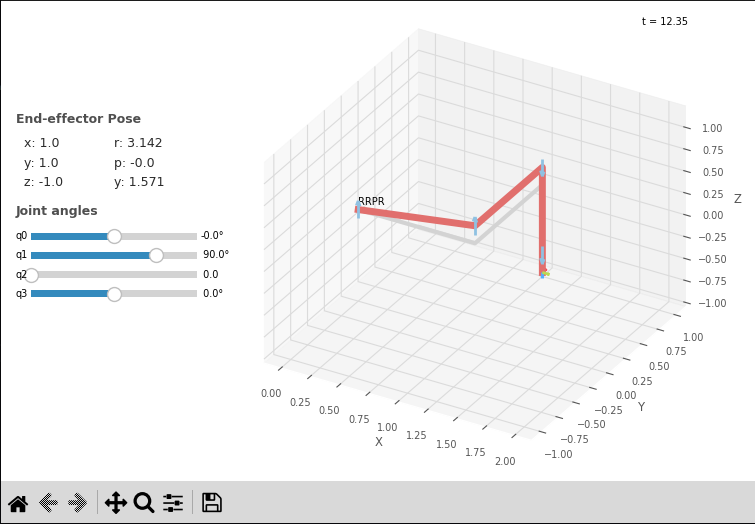

# Robotics_AB2_Part1

## Problema 1:

### A)

Sendo o espaço de trabalho do braço robô planar RR limitado pelo comprimento dos elos L1 e L2, bem como pelos limites de rotação das juntas, podemos calcular e visualizar o espaço de trabalho com a nuvem de pontos utilizando o a função r_planar_work_space() de P1.py.

**Temos o espaço de trabalho planar:**

<div style="display: flex;">
  <a name="figura1"></a>
  
  <a name="figura2"></a>
  
</div>

Podemos observar que, sendo o braço robótico planar, ele está restrito ao plano XY, onde podemos visualizar as restrições das juntas na primeira figura e os pontos possíveis de serem alcançados, sendo:
<br>
**L1 = L2 = 1**, e as rotações: **$` 0 < \theta1 < \pi`$** e **$` -\pi/2 < \theta2 < \pi`$**.

### B)

Para implementar uma função de cinemática inversa, devemos calcular a cinemática inversa do atuador:

Sabemos que a tabela DH para um manipulador Planar é:

| j   | θⱼ  | dⱼ  | aⱼ  | ⍺ⱼ   |
| --- | --- | --- | --- | ---- |
| 1   | q1  | 0   | L1  | 0.0° |
| 2   | q2  | 0   | L2  | 0.0° |

Podemos então calcular a Pose final da base até o atuador utilizando as transformações:

$`^jT_{j+1}=\begin{bmatrix}\cos \theta _j&-\sin \theta _j\cos \theta2 _j&\sin \theta _j\sin \theta2 _j&a_j\cos \theta _j\\
\sin \theta _j&\cos \theta _j\cos \theta2 _j&-\cos \theta _j\sin \theta2 _j&a_j\sin \theta _j\\
0&\sin \theta2 _j&\cos \theta2 _j&d_j\\
0&0&0&1\end{bmatrix}`$

Sendo, para simplificação **$`S_{\theta1} = Sen(\theta1), C_{\theta1} = Cos(\theta1)`$** e os outros análogos, temos:

$`^BT_W=^0T_2=^0T_1\cdot^1T_2=\begin{bmatrix}C_{\theta1}&-S_{\theta1}&0&L_1C_{\theta1}\\
S_{\theta1}&C_{\theta1}&0&L_1S_1\\
0&0&1&0\\
0&0&0&1\end{bmatrix}\begin{bmatrix}C_{\theta2}&-S_{\theta2}&0&L_2C_{\theta2}\\
S_{\theta2}&C_{\theta2}&0&L_2S_2\\
0&0&1&0\\
0&0&0&1\end{bmatrix}=\ \begin{bmatrix}C_{\theta1}C_{\theta2}&S_{\theta1}S_{\theta2}&0&L_1C_{\theta1}+L_2C_{\theta1}C_{\theta2}\\
S_{\theta1}S_{\theta2}&C_{\theta1}C_{\theta2}&0&L_1S_{\theta1}+L_2S_{\theta1}S_{\theta2}\\
0&0&1&0\\
0&0&0&1\end{bmatrix}`$

Assim, para uma Pose qualquer no espaço de trabalho:

$`^BT_W=\begin{bmatrix}C_{\phi}&-S_{\phi}&0&x\\
S_{\phi}&C_{\phi}&0&y\\
0&0&1&0\\
0&0&0&1\end{bmatrix}`$

Igualando as Poses, temos o sistema:

1 - $`S_{\phi}=S_{\theta1}S_{\theta2}`$

2 - $`C_{\phi}=C_{\theta1}C_{\theta2}`$

3 - $`x=L_1C_{\theta1}+L_2C_{\theta1}C_{\theta2}`$

4 - $`y=L_1S_{\theta1}+L_2S_{\theta1}S_{\theta2}`$

Elevando as equações 3 e 4 ao quadrado e somando, temos:

$`x^2+y^2=L_1^{\ \ 2}+L_2^{\ \ 2}+2L_1L_2C_{\theta 2}`$

Pelas relações trigonométricas, podemos escrever:

$`C_{\theta 2}=\frac{x^2+y^2-L_1^{\ \ 2}-L_2^{\ \ 2}}{2L_1L_2}`$

$`S_{\theta 2}=\pm \sqrt{1-C_{\theta 2}^{\ \ \ \ 2}}`$

Isolando o ângulo:

$`\theta _2=A\tan 2(S_{\theta 2},C_{\theta 2})`$

Temos as equações para x e y:

5 - $`x=(k1)C_{\theta 1}-(k2)S_{\theta 1}`$

6 - $`y=(k1)S_{\theta 1}+(k1)C_{\theta 1}`$

<br>

Sendo:

$`k_1=(L_1+L_2C_{\theta 2})`$,

$`k_2=\ L_2S_{\theta 2}`$,

$`r=\sqrt{k_1^{\ \ 2}+k_2^{\ \ 2}}`$ e

$`\gamma =A\tan 2\left(k_1\ ,\ k_2\right)`$

Substituindo em k1 e k2 em função do r e de $`\gamma`$, temos:

$`k_1\ =\ r\cos \ \gamma `$

$`k_2\ =\ r\cos \ \gamma `$

Substituindo nas equações 5 e 6, temos:

$`\frac{x}{r}\ =\ C_{\gamma }C_{\theta 1}-\ S_{\gamma }S_{\theta 1}`$

$`\frac{y}{r}\ =\ C_{\gamma }S_{\theta 1}\ +\ S_{\gamma }C_{\theta 1}`$

Manipulando:

$`C\left(\gamma +\ \theta 1\right)\ =\ \frac{x}{r}`$

$`S\left(\gamma +\ \theta 1\right)\ =\ \frac{y}{r}`$

$`\gamma+\ \theta1\ =\ A\tan2\left(\frac{y}{r},\frac{x}{e}\right)=A\tan2\left(y,x\right)`$

Assim, temos:

$`\begin{array}{l}\theta1\ =\ A\tan2\left(y,x\right)\ -\ A\tan2\left(k_1,k_2\right)\end{array}`$

Onde podemos achar $`\theta1`$ e $`\theta2`$ para a pose $`^BT_W`$.

Aplicando isto no código, temos a função inkine_RRR do arquivo P1.py.

Utilizando o código, temos as Resultadoss:

#### Teste 1:

```
T = transl(0, 1, 0)
ikine_rr(T)
```

**Resultados:**

```
Pose:
 [[1.  0.  0.  0.]
 [0.  1.  0.  1. ]
 [0.  0.  1.  0. ]
 [0.  0.  0.  1. ]]
Soluções:
Solução 1:
θ1: 0.5235987755982989 θ2: 2.0943951023931957
```

<p align="center">
  <a name="figura-3"></a>
  
</p>

#### Teste 2:

```
T = transl(3, 1, 0)
ikine_rr(T)
```

**Resultados:**

```
Pose:
 [[1. 0. 0. 3.]
 [0. 1. 0. 1.]
 [0. 0. 1. 0.]
 [0. 0. 0. 1.]]
Não é possível mover até o ponto. Fora de alcance.
```

Podemos notar que para algumas poses, como no Teste 2, o manipulador não consegue alcançar, devido as limitações de comprimento das juntas (L1 + L2).

### C)

Em um manipulador RR planar (que possui duas juntas rotativas), a orientação do efetuador final é determinada pelas posições das juntas q1 e q2 e pelas características físicas do manipulador, como os comprimentos dos elos. Por esse motivo, diferente de outros manipuladores robóticos que podem possuir uma junta rotativa na mesma posição do efetuador final para indicar a orientação dele, a orientação do efetuador final em um manipulador do tipo RR planar fica limitada as possíveis soluções para determinada Pose. Uma determinada Pose pode possuir uma ou duas soluções para um manipulador RR planar, e nesse caso teríamos duas possíveis orientações do efetuador final. Porém estar orientações seriam limitadas a essas duas soluções finais, não sendo possível especificar uma orientação final específica.

### D)

Quando calculamos a cinemática inversa, podemos ter até dois conjuntos de soluções para as juntas, já que $`\theta2`$ pode assumir valores negativos e positivo devido à raiz quadrada, porém, em certos pontos chamados de pontos singulares, a posição só pode ser alcançada a partir de um conjunto único de ângulos, isto pode acontecer quando $`\theta2`$ atinge valores abaixo do mínimo da junta ou acima do máximo da junta, fazendo com que o braço perca um grau de liberdade, estas posições são comuns nos extremos do espaço de trabalho, onde só podem ser alcançados quando $`\theta2 = \pm 90°k`$ e o braço está todo esticado (L1 + L2).

### E)

Quando a pose é inalcançável, o manipulador não consegue movimentar o efetuador final até a posição desejada. Nesse caso, como temos um manipulador simples e nossa função de cálculo de inversa foi feita de forma analítica, podemos verificar ativamente se a pose é inalcançável e informar previamente. No caso de manipuladores muito complexos, onde uma forma analítica da cinemática inversa não pode ser definida, podem existir medidas de segurança para evitar que o manipulador tente atingir posições fora de seu campo de trabalho e ocasione algum dano a si mesmo.

## Problema 2:

### A)

Similarmente ao Problema 1, podemos representar o espaço de trabalho (assim como a nuvem de pontos possíveis) da pata robótica RRR, a partir da função rrr_work_space() do arquivo "P2.py"

Os pontos da nuvem são calculados através da cinemática e da tabela DH:

| j   | θⱼ       | dⱼ  | aⱼ  | ⍺ⱼ    |
| --- | -------- | --- | --- | ----- |
| 1   | θ1 + 90° | 0   | 0   | 90.0° |
| 2   | θ2       | 0   | L1  | 0.0°  |
| 2   | θ3 - 90° | 0   | L2  | 0.0°  |

$`^0T_3 = ^0T_1*^1T_2*^2T_3`$

$`^0T_3 = \begin{bmatrix}
cos(θ+90°)&-sin(θ + 90°)cos(90°)&sin(θ + 90°)sin(90°)&L2*cos(θ+90°)\\
sin(θ+90°)&cos(θ+90°)cos(90°)&-cos(θ + 90°)sin(90°)&L2*sin(θ+90°)\\
0&sin(90°)&cos(90°)&0\\
0&0&0&1
\end{bmatrix}
\begin{bmatrix}cos(θ2)&-sin(θ2)cos(0°)&sin(θ2)sin(0°)&R*cos(θ2)\\
sin(θ2)&cos(θ2)cos(0°)&-cos(θ2)sin(0°)&R*sin(θ2)\\
0&sin(0°)&cos(0°)&0\\
0&0&0&1
\end{bmatrix}
\begin{bmatrix}cos(θ3-90°)&-sin(θ3-90°)cos(0°)&sin(θ3-90°)sin(0°)&L1*cos(θ3-90°)\\
sin(θ3-90°)&cos(θ3-90°)cos(0°)&-cos(θ3-90°)sin(0°)&L1*sin(θ3-90°)\\
0&sin(0°)&cos(0°)&0\\0&0&0&1
\end{bmatrix}`$

$`^0T_3=\begin{bmatrix}-\sin\left(θ\right)&0&\cos\left(θ\right)\ &0\\
\cos(θ)&0&\sin(\theta)&0\\
0&1&0&0\\
0&0&0&1\end{bmatrix}\begin{bmatrix}\cos(\theta3)&-\sin(\theta3)&0&L1*\cos(θ2)\\
\sin(\theta3)&\cos(\theta3)&0&L1*\sin(θ2)\\
0&0&1&0\\
0&0&0&1\end{bmatrix}\begin{bmatrix}\sin(\theta2)&\cos(\theta2)&0&L2*\sin(\theta2)\\
-\cos(\theta2)&\sin(\theta2)&0&L2*\cos\left(\theta2\right)\\
0&0&1&0\\
0&0&0&1\end{bmatrix}`$

$`^0T_{3=}\begin{bmatrix}-\sin(θ2)\cos(θ3)\sin(θ)-\cos(θ2)\sin(θ3)\sin(θ)&\sin(θ2)\sin(θ3)\sin(θ)-\cos(θ2)\cos(θ3)\sin(θ)&\cos(θ)&-L1\cos(θ3)\sin(θ)-L2\sin(θ2)\cos(θ3)\sin(θ)-L2\cos(θ2)\sin(θ3)\sin(θ)\\
\sin(θ2)\cos(θ3)\cos(θ)+\cos(θ2)\sin(θ3)\cos(θ)&\cos(θ2)\cos(θ3)\cos(θ)-\sin(θ2)\sin(θ3)\cos(θ)&\sin(θ)&L1\cos(θ3)\cos(θ)+L2\sin(θ2)\cos(θ3)\cos(θ)+L2\cos(θ2)\sin(θ3)\cos(θ)\\
\sin(θ2)\sin(θ3)-\cos(θ2)\cos(θ3)&\sin(θ2)\cos(θ3)+\cos(θ2)\sin(θ3)&0&L1\sin(θ3)+L2\sin(θ2)\sin(θ3)-L2\cos(θ2)\cos(θ3)\\
0&0&0&1\end{bmatrix}`$
Portanto:

```
x = -Kcos(θ3)sin(θ)-Lsin(θ2)cos(θ3)sin(θ)-Lcos(θ2)sin(θ3)sin(θ)
y = Kcos(θ3)cos(θ)+Lsin(θ2)cos(θ3)cos(θ)+Lcos(θ2)sin(θ3)cos(θ)
z = Ksin(θ3)+Lsin(θ2)sin(θ3)-Lcos(θ2)cos(θ3)
```

**Resultados:**

<div style="display: flex;">
  <a name="figura4"></a>
  
  <a name="figura5"></a>
  
</div>

Podemos observar que existe regiões dentro da esfera de espaço de trabalho que o manipulador não consegue se posicionar devido às limitações das suas juntas.

## B)

Observando o plano ZY da pata robótica, podemos ver que a pata do robô se comporta com um manipulador RR planar,assim, pelo método geométrico podemos descobrir $`\theta1, \theta2`$ e $`\theta3`$. Tendo assim a função ikine.

Aplicando a Lei dos cossenos no triângulo formado pela pata robótica, temos:

$` (\sqrt{z^2 +y^2})^2 = L1^2 + L2^2 - 2*L1*L2os(180° - \theta3) `$

Simplificando em função de $`cos(\theta3)`$:

$`cos(\theta3) = \frac{z^2 +y^2 - L1^2 - L2^2}{2*L1*L2}`$

Usando a relação trigonométrica:

$`cos(\theta)^2 + sin(\theta)^2 = 1`$

Temos assim $`\theta3`$:

$`sin(\theta3) = \sqrt{1 - Cos(\theta3)^2}`$

$`\theta3 = Atan2(sin(\theta2), cos(\theta 2))`$

Para calcularmos $`\theta2`$ temos:

$`\theta2 = Atan2(z,y)`$

<br>

e Pela lei dos cossenos no outro triângulo:

$`L2^2 = L1^2 + (\sqrt{z^2 +y^2})^2 - 2*L1*\sqrt{z^2 +y^2}cos(\phi)`$

$`cos(\phi) = \frac{z^2 +y^2 + L1^2 - L2^2}{2*L1*\sqrt{z^2 +y^2}}`$

Usando a relação trigonométrica:

$`sin(\phi) = \sqrt{1 - Cos(\phi)^2}`$

$`\phi = Atan2(sin(\phi), cos(\phi))`$

Assim:

$`\theta1 =\theta3 + \phi `$

Então para calcular $`\theta 1`$:

$`\theta1 = Atan2(y,x)`$

Tendo a cinemática inversa da pata robótica, podemos modelá-la utilizando a robotics-toolbox. A modelagem foi feita na função ikine_rrr() do arquivo P2.py.

## C)

Utilizaremos a função ikine_rrr() desenvolvida na letra B anterior para comparar com a representação utilizando a classe RobotDH (implementada na função robot_rrr()).

Temos a representação da pata robótica em posição (0, 0, 0):

<p align="center">
  
</p>

### Teste 1:

```
(x=0, y=1,z =0)
```

**Resultados:**

Teste 1:

```
Possíveis soluções:
θ1= 0.0 θ2= -0.8410686705679301 θ3= 3.2529336679307566
θ1= 0.0 θ2= 0.8410686705679301 θ3= -0.11134101434096366
Pose =
    0         0         1         0
   0.6667   -0.7454    0         0.2
   0.7454    0.6667    0         0
   0         0         0         1

Solução 1 da ikine_LM:
 IKSolution: q=[0, -0.8411, -3.03], success=True, iterations=7, searches=1, residual=3.64e-07
Pose =
    0         0         1         0
   0.6667    0.7454    0         0.2
  -0.7454    0.6667    0         0
   0         0         0         1

Solução 2 da ikine_LM:
 IKSolution: q=[0, 0.8411, -0.1113], success=True, iterations=22, searches=1, residual=3.92e-10
```

Teste 2:

```
Possíveis soluções:
θ1= 0.0 θ2= -1.8653118119030336 θ3= 3.730623623806067
θ1= 0.0 θ2= 0.2945154851081371 θ3= -0.5890309702162737
Pose =
    0         0         1         0
   0.9008   -0.4342    0         0.07
   0.4342    0.9008    0        -0.07
   0         0         0         1

Solução 1 da ikine_LM:
 IKSolution: q=[0, -2.02, -2.243], success=True, iterations=13, searches=1, residual=4.24e-09
Pose =
    0         0         1         0
  -0.4342    0.9008    0         0.07
  -0.9008   -0.4342    0        -0.07
   0         0         0         1

Solução 2 da ikine_LM:
 IKSolution: q=[0, 0.4491, -0.8982], success=True, iterations=5, searches=1, residual=5.93e-13
```

Podemos verificar, que os resultados encontrados com nossa função ikine_rrr(), são bem próximos dos resultados encontrados utilizando a solução numérica ikine_LM. O que comprova que a cinemática inversa foi calculada e implementada de forma correta. A breve diferença entre os valores se dá por que a solução ikine_LM é uma solução numérica e não analítica, e, portanto, possui uma margem de erro.

# Problema 3:

Semilar ao problema anterior, podemos deduzir a ikine do manipulador Scara de forma analítica trigonométrica:

Dividindo o manipulador em duas partes, sendo $`\theta1`$ e $`\theta2`$ um braço planar RR, temos pela lei dos cossenos:

$` (\sqrt{x^2 +y^2})^2 = L1^2 + L2^2 - 2*L1*L2os(180° - \theta2) `$

Simplificando em função de $`cos(\theta3)`$

$`cos(\theta2) = \frac{x^2 +y^2 - L1^2 - L2^2}{2*L1*L2}`$

Usando a relação trigonométrica:

$`cos(\theta)^2 + sin(\theta)^2 = 1`$

Assim:

$`sin(\theta2) = \sqrt{1 - Cos(\theta2)^2}`$

$`\theta2 = Atan2(sin(\theta2), cos(\theta 2))`$

Para encontrar $`\theta2`$, temos:

$`\theta3 = Atan2(x,y)`$

<br>

Utilizando novamente a lei dos cossenos podemos achar $`\phi`$:

$`L2^2 = L1^2 + (\sqrt{x^2 +y^2})^2 - 2*L1*\sqrt{x^2 +y^2}cos(\phi)`$

Simplificando em função de $`\phi`$:

$`cos(\phi) = \frac{x^2 +y^2 + L1^2 - L2^2}{2*L1*\sqrt{x^2 +y^2}}`$

Usando a relação trigonométrica:

$`sin(\phi) = \sqrt{1 - Cos(\phi)^2}`$

$`\phi = Atan2(sin(\phi), cos(\phi))`$

Já para achar a junta prismática D3, temos que:

$`-z = - D2 + D3 + D4 `$

Assim:

$`D3 = -z - D4 + D2`$

Como $`\theta4`$ influencia apenas na orientação do efetuador final, temos:

$`\theta4 = 0°`$

A cinemática inversa foi implementada na função ikine_scara no arquivo P3.py.

#### Teste 1:

```
ikine_scara(x = 0,y = 1, z = -0.5)
```

**Resultados:**

```
Soluções:
θ1= 0.5235987755982989 θ2= 2.0943951023931957 D3= 0.5 θ4= 0
θ1= 2.617993877991494 θ2= -2.0943951023931957 D3= 0.5 θ4= 0

```

<div style="display: flex;">
  
  
</div>

#### Teste 2:

```
ikine_scara(x = 1,y = 1, z = -1)
```

**Resultados:**

```
Soluções:
θ1= -1.1102230246251565e-16 θ2= 1.5707963267948966 D3= 1.0 θ4= 0
θ1= 1.5707963267948966 θ2= -1.5707963267948966 D3= 1.0 θ4= 0
```

<div style="display: flex;">
  
  
</div>

Podemos observar que, para os testes realizados, temos duas possíveis soluções, assim como no Problema 1. Assim, podemos mover o efetuador final para o mesmo ponto utilizando duas orientações de juntas diferentes.
