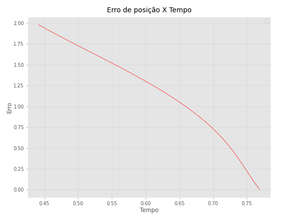
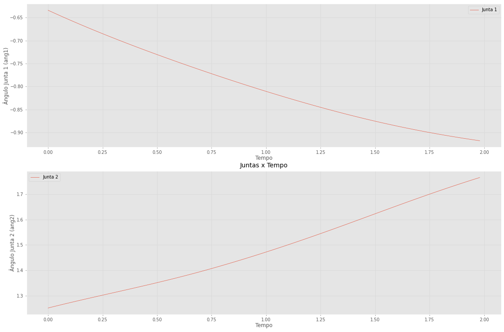
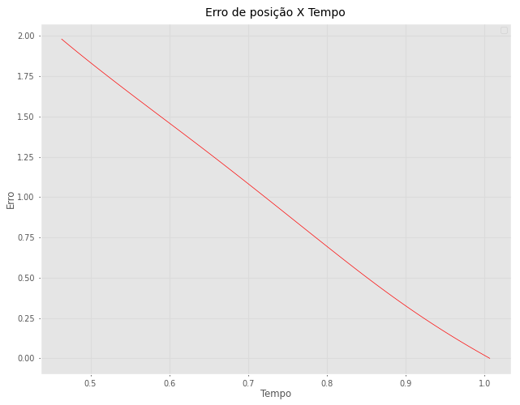
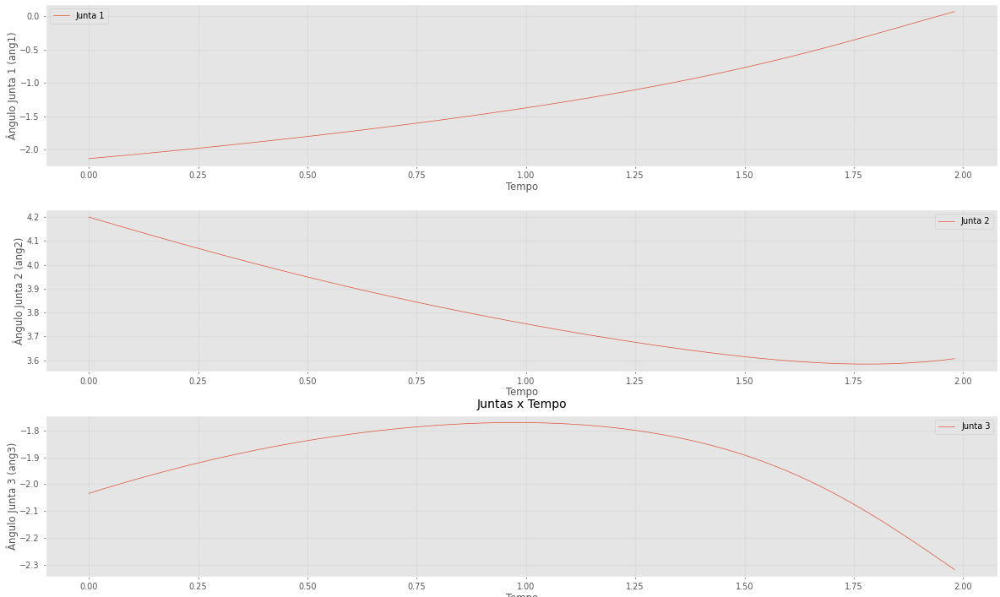
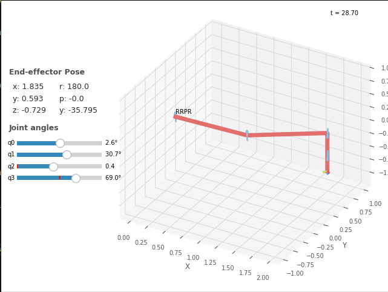
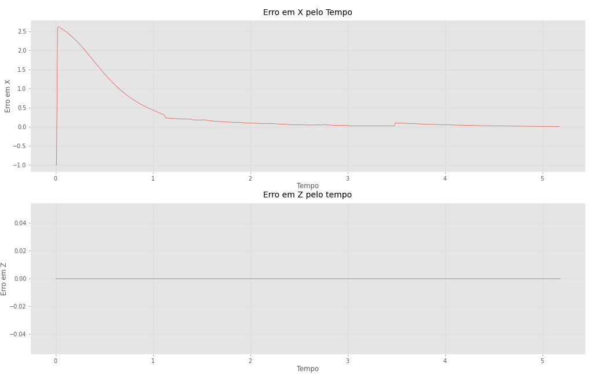

# Robotic_AB2_Part2

## Questão 1:

Temos que a tabela DH para um manipulador planar RR é:

| j   | θⱼ  | dⱼ  | aⱼ  | ⍺ⱼ   |
| --- | --- | --- | --- | ---- |
| 1   | θ1  | 0   | L1  | 0.0° |
| 2   | θ2  | 0   | L2  | 0.0° |

Assim, podemos calcular analíticamente a Pose final pela transformação:

$`^jT_{j+1}=\begin{bmatrix}\cos \theta _j&-\sin \theta _j\cos \alpha _j&\sin \theta _j\sin \alpha _j&a_j\cos \theta _j\\
\sin \theta _j&\cos \theta _j\cos \alpha _j&-\cos \theta _j\sin \alpha _j&a_j\sin \theta _j\\
0&\sin \alpha _j&\cos \alpha _j&d_j\\
0&0&0&1\end{bmatrix}`$

Onde temos que a Pose final será dada por:

$`^0T_2=^0T_1\cdot^1T_2`$

$`^0T_2=\begin{bmatrix}Cos(\theta1)&-Sen(\theta1)&0&L_1Cos(\theta1)\\
Sen(\theta1)&Cos(\theta1)&0&L_1Sen(\theta1)\\
0&0&1&0\\
0&0&0&1\end{bmatrix}\begin{bmatrix}Cos(\theta2)&-Sen(\theta2)&0&L_2Cos(\theta2)\\
Sen(\theta2)&Cos(\theta2)&0&L_2Sen(\theta2)\\
0&0&1&0\\
0&0&0&1\end{bmatrix}`$

$`^0T_2=\begin{bmatrix}
cos(\theta1)*cos(\theta2) - sin(\theta1)*sin(\theta2) & sin(\theta1)*(-cos(\theta2)) - cos(\theta1)*sin(\theta2) & 0 & -L2 sin(\theta1) sin(\theta2) + L2 cos(\theta1) cos(\theta2) + L1 cos(\theta1)\\
sin(\theta1)*cos(\theta2) + cos(\theta1)*sin(\theta2) & cos(\theta1)*cos(\theta2) - sin(\theta1)*sin(\theta2) & 0 & L2*sin(\theta1)*cos(\theta2) + L2*cos(\theta1)*sin(\theta2) + L1*sin(\theta1)\\
0 & 0 & 1 & 0\\
0 & 0 & 0 & 1\end{bmatrix}`$

Sendo assim, podemos concluir que x e y são:

$`x =L1*cos(\theta1) + L2*cos(\theta1 + \theta2)`$

$`y = L1*sin(\theta1) + L2*sin(\theta1 + \theta2)`$

Então, de forma analitica podemos calcular a Jacobiana para esse manipulador:

$`J(q) = \frac{\partial}{\partial(q)}K(q)=\begin{bmatrix}\frac{\partial x}{\partial(θ1)}&\frac{\partial x}{\partial(θ2)}\\\frac{\partial y}{\partial(θ1)}&\frac{\partial y}{\partial(θ2)}\end{bmatrix}`$

Derivando:

$`\frac{\partial x}{\partial(θ1)} =  -L1*sin(θ1) - L2*sin(θ2 + θ1)`$

$`\frac{\partial x}{\partial(θ2)} = -L2*sin(θ2 + θ1)`$

$`\frac{\partial y}{\partial(θ1)} = L1*cos(θ1) + L2*cos(θ2 + θ1)`$

$`\frac{\partial y}{\partial(θ2)} =  L2*cos(θ2 + θ1)`$

$`J(q) =\begin{bmatrix}-L1*sin(θ1) - L2*sin(θ2 + θ1)&-L2*sin(θ2 + θ1)\\ L1*cos(θ1) + L2*cos(θ2 + θ1)&  L2*cos(θ2 + θ1)\end{bmatrix}`$

### A)

Utilizando a robotics-toolbox de Peter Corke, foi possível modelar o braço planar RR utilizando a classe DHRobot utilizando a função rr_robot() (arquivo [P1.py](P1.py))

A trajetória entre TE1 e TE2 pode ser canculada utilizando a função ctraj. Essa trajetória é composta por um array contendo todas as poses em um determinado período de tempo entre TE1 e TE2.

Tendo o array de trajetória, podemos utilizar a matriz Jacobiana encontrada anteriormente para implementar o algoritmo **resolved rate control**, para, utilizando as trajetórias e velocidades das juntas, reduzir o erro e integrar os ângulos das juntas até a pose final desejada. Dessa forma, podemos encontrar os valores dos ângulos das juntas, sem ser necessário realizar o cálculo da cinemática inversa do manipulador. O algoritmo foi implementado na função resolved_rate_control_2r() (arquivo [P1.py](P1.py))

**Temos os ângulos finais das juntas para a Pose (setup.py):**

```
q = [-0.9182050704747622, 1.7654030627350557]
```

Podemos notar algumas diferencças de se utilizar este método em relação ao cálculo da cinemática inversa analiticamente. No caso do algoritmo implementado, temos apenas uma solução, pois o mesmo utiliza de um conceito de sistema de controle, onde ele busca minimizar o erro para encontrar os ângulos desejados, dessa forma encontrando apenas o conjunto de ângulos mais próximos da pose inicial. Outro ponto a ser considerado é a presença de "pontos de singularidades", nas quais são pontos que impede que o manipulador alcance a pose especificada, e que o algoritmo não considera isso, sendo necessário alguma implementação a mais para impedir tais casos.

Para melhor a aproximação podemos modificar o parâmetro Lambda ou aumentar o tempo para que o erro diminua.

### B)

A matriz Jacobiana é utilizada para descrever o impacto na saída de mudanças nas variáveis de um sistema, sendo utilizada para análise de sistemas dinâmicos. A sua inversa é muito utilizada para encontrar as mudanças nas variáveis que acarretam a uma mudança desejada na saída. Já a sua transposta apenas reorganiza as entradas da matriz, ou seja, não possui a mesma utilizada da inversa, onde nesse caso não iria encontrar os valores desejados dos ângulos para as juntas.

### C)

Podemos utilizar a função implementada plot_p1() (arquivo [P1.py](P1.py)), para plotar os gráficos de erro de posição e das juntas em relação ao tempo, obtendo os seguintes resultados:

<div style="display: flex;">
  <a name="figura1"></a>
  
  <a name="figura2"></a>
  
</div>

Podemos verificar que, conforme o tempo passa e as juntas vão se posicionando na posição desejada, o erro vai diminuindo.

## Questão 2:

Análogamente a Questão 1, temos as transforamções para o manipulador RRR:

$`^0T_3=^0T_1\cdot^1T_2\cdot^2T_3`$

$`^0T_3=\begin{bmatrix}Cos(\theta1)&-Sen(\theta1)&0&L_1Cos(\theta1)\\
Sen(\theta1)&Cos(\theta1)&0&L_1Sen(\theta1)\\
0&0&1&0\\
0&0&0&1\end{bmatrix}\begin{bmatrix}Cos(\theta2)&-Sen(\theta2)&0&L_2Cos(\theta2)\\
Sen(\theta2)&Cos(\theta2)&0&L_2Sen(\theta2)\\
0&0&1&0\\
0&0&0&1\end{bmatrix}\begin{bmatrix}Cos(\theta3)&-Sen(\theta3)&0&L_3Cos(\theta3)\\
Sen(\theta3)&Cos(\theta3)&0&L_3Sen(\theta3)\\
0&0&1&0\\
0&0&0&1\end{bmatrix}`$

$`^0T_3=\begin{bmatrix}
cos(\theta1 + \theta2 + \theta3 ) & -sin(\theta1 + \theta2 +\theta1) & 0 & L_1*cos(\theta1) + L_2*cos(\theta1 + \theta2) + L_3*cos(\theta1 + \theta2 + \theta3)\\
sin(\theta1 + \theta2 +\theta1) & cos(\theta1 + \theta2 + \theta3 ) & 0 & L_1*sin(\theta1) + L_2*sin(\theta1 + \theta2) + L_3*sin(\theta1 + \theta2 + \theta3)\\
0 & 0 & 1 & 0\\
0 & 0 & 0 & 1\end{bmatrix}`$

Temos que a matriz Jacobiana pelo método geométrico é dada por:

$`J = \begin{bmatrix}
J_{P1}&...&J_{Pn}\\
J_{O1}&...&J_{On}
\end{bmatrix}`$

Sendo:

Para juntas de revolução:

$`\begin{bmatrix}
J_{Pi}\\
J_{Oi}
\end{bmatrix} = \begin{bmatrix}
z_{i-1}x(p-p_{i-1})\\ z_{i-1}
\end{bmatrix}`$

Para juntas Prismatica:

$`\begin{bmatrix}
J_{Pi}\\
J_{Oi}
\end{bmatrix} = 
\begin{bmatrix}
z_{i-1}\\ 0
\end{bmatrix}`$

Assim, para o manipulador RRR planar, temos:

$`\bar p_0 = \begin{bmatrix}0\\0\\0\\1\end{bmatrix}`$

$`p = \begin{bmatrix}
L1cos(\theta1) + L2cos(\theta1 + \theta2) + L3cos(\theta1  + \theta2  + \theta3)\\
L1sin(\theta1) + L2sin(\theta1 + \theta2) + L3sin(\theta1  + \theta2  + \theta3)
\end{bmatrix}`$

$`J(q) = \begin{bmatrix}
z_{0}x(p-p_{0})&z_{1}x(p-p_{1})&z_{2}x(p-p_{2})\\ 
z_{0} &z_{1}& z_{2}
\end{bmatrix}`$

$`p_0 = ^0T_0*\bar p_0 \begin{bmatrix}
1&0&0&0\\
0&1&0&0\\
0&0&1&0\\
0&0&0&1
\end{bmatrix}*\begin{bmatrix}0\\0\\0\\1\end{bmatrix} = \begin{bmatrix}0\\0\\0\end{bmatrix}`$

$`z_0 = \begin{bmatrix} 0\\0\\1\end{bmatrix}`$

$`p_1 = ^0T_1*\bar p_0 \begin{bmatrix}
cos(\theta1)&-sin(\theta1)&0&L1cos((\theta1))\\
sin(\theta1)&cos(\theta1)&0&L1sin(\theta1)\\
0&0&1&0\\
0&0&0&1
\end{bmatrix}*\begin{bmatrix}L1cos(\theta1)\\L1sin(\theta1)\\0\\1\end{bmatrix} = \begin{bmatrix}L1cos(\theta1)\\L1sin(\theta1)\\0\end{bmatrix}`$

$`z_1 = \begin{bmatrix} 0\\0\\1\end{bmatrix}`$

$`p_2 = ^0T_2*\bar p_0 \begin{bmatrix}
cos(\theta2)&-sin(\theta2)&0&L1cos(\theta1) +L2cos(\theta2)\\
sin(\theta2)&cos(\theta2)&0&L1sin(\theta1) + L2sin(\theta2)\\
0&0&1&0\\
0&0&0&1
\end{bmatrix}*\begin{bmatrix}L1cos(\theta1)\\L1sin(\theta1)\\0\\1\end{bmatrix} = \begin{bmatrix}L1cos(\theta1) +L2cos(\theta2)\\L1sin(\theta1) + L2sin(\theta2)\\0\end{bmatrix}`$

$`z_2 = \begin{bmatrix} 0\\0\\1\end{bmatrix}`$

Temos que:

$`z_0 x (p - p_0) = \begin{bmatrix}
-L1sin(\theta1) -L2sin(\theta1 + \theta2) -L3sin(\theta1 + \theta2 + \theta3)\\
L1cos(\theta1) + L2cos(\theta1 + \theta2) +L3cos(\theta1 + \theta2 + \theta3)\\
0
\end{bmatrix}`$

$`z_1 x (p - p_1) = \begin{bmatrix}
 -L2sin(\theta1 + \theta2) -L3sin(\theta1 + \theta2 + \theta3)\\
L2cos(\theta1 + \theta2) +L3cos(\theta1 + \theta2 + \theta3)\\
0
\end{bmatrix}`$

$`z_2 x (p - p_2) = \begin{bmatrix}
-L3sin(\theta1 + \theta2 + \theta3)\\
L3cos(\theta1 + \theta2 + \theta3)\\
0
\end{bmatrix}`$

Assim, temos que a Jacobiana é dada por:

$`J(q) = \begin{bmatrix}-L1sin(\theta1) -L2sin(\theta1 + \theta2) -L3sin(\theta1 + \theta2 + \theta3) &-L2sin(\theta1 + \theta2) -L3sin(\theta1 + \theta2 + \theta3) & -L3sin(\theta1 + \theta2 + \theta3)\\
L1cos(\theta1) + L2cos(\theta1 + \theta2) +L3cos(\theta1 + \theta2 + \theta3)&L2cos(\theta1 + \theta2) +L3cos(\theta1 + \theta2 + \theta3)&L3cos(\theta1 + \theta2 + \theta3)\\
0&0&0\\
0&0&0\\
0&0&0\\
1&1&1
\end{bmatrix}`$

Removendo as linhas zeradas, temos a Jacobiana simplificada:

$`J(q) = \begin{bmatrix}-L1sin(\theta1) -L2sin(\theta1 + \theta2) -L3sin(\theta1 + \theta2 + \theta3) &-L2sin(\theta1 + \theta2) -L3sin(\theta1 + \theta2 + \theta3) & -L3sin(\theta1 + \theta2 + \theta3)\\
L1cos(\theta1) + L2cos(\theta1 + \theta2) +L3cos(\theta1 + \theta2 + \theta3)&L2cos(\theta1 + \theta2) +L3cos(\theta1 + \theta2 + \theta3)&L3cos(\theta1 + \theta2 + \theta3)\\
1&1&1
\end{bmatrix}`$

De maneira análoga a questão 1, utilizando as funções implementadas no arquivo [P2.py](P2.py), podemos modelar o manipulador RRR e calcular os ângulos finais das juntas utilizando a Jacobiana:

**Temos os ângulos finais das juntas para a Pose (setup.py):**

```
q = [0.06813279800467176, 3.6065877410773783, -2.318719353838379]
```

Podemos notar que, da mesma forma da questão anterior, utilizando o algoritmo **resolved rate control**, obtemos de maneira facilitada a cinemática inversa do manipulador. Neste caso utilizando o yaw como variável de controle para encontrar o ângulo da terceira junta. Podemos observar também que, por conta de um ajuste que pode ser necessário quando o determinante da Jacobiana é zero, a pose aproximada calculada pelo algoritmo pode se diferenciar da pose desejada real.

**Erro de posição em relação ao tempo e ângulos das juntas:**

<div style="display: flex;">
  <a name="figura1"></a>
  
  <a name="figura2"></a>
  
</div>

Nesse caso podemos observar que o erro se aproxima muito de zero e as juntas são rotacionadas até a pose correta.

## Questão 3:

Sabendo que a Jacobiana de um manipulador do tipo Scara já é conhecida, podemos obtê-la do livro A Mathematical Introduction to Robotic Manipulation, de Richard M. Murray, que pode ser expressa como a matriz:

$J_q=\begin{bmatrix}
-a_1s_1-a_2s_{12}&a_1c_1+a_1c_{12}&0\\
-a_2s_{12}&a_2c_{12}&0\\
0&0&0\end{bmatrix}$

Dessa forma, podemos aplicá-la, de forma análoga a questão 2, utilizando a função resolved_rate_control_scara() (arquivo [P3.py](P3.py)) e suas funções auxiliares.

Podemos observar que, devido a geometria do manipulador, precisamos nos preocupar principalmente com o eixo X, pois é o eixo movimentado, e parcialmente com o eixo Z, pois apenas uma junta pode movimentálo, e temos que o eixo Y é fixo e portanto não precisamos nos preocupar com o erro nele. Dessa forma, podemos plotar o manipulador e seus respectivos erros:

Manipulador:

<a name="figura1"></a>


Erros nos eixos X e Z:

<a name="figura1"></a>


Podemos observar que o erro tende a 0 no eixo X, o que comprova que o algoritmo está implementado e calculando a cinemática inversa da Scara. Podemos observar também que o erro em Z já está em zero desde o início, o que se dá pois a mudança de posição não precisa alterar a junta prismática que altera a posição em Z.
